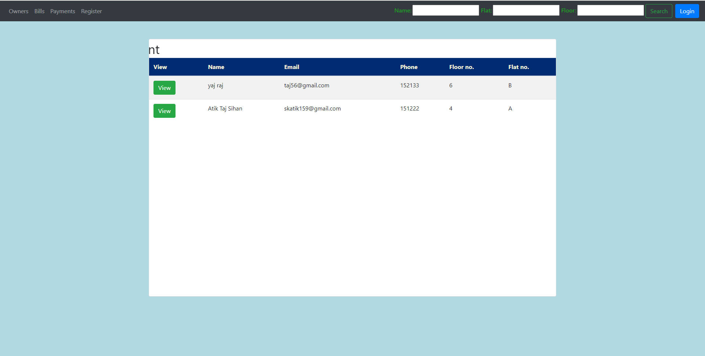
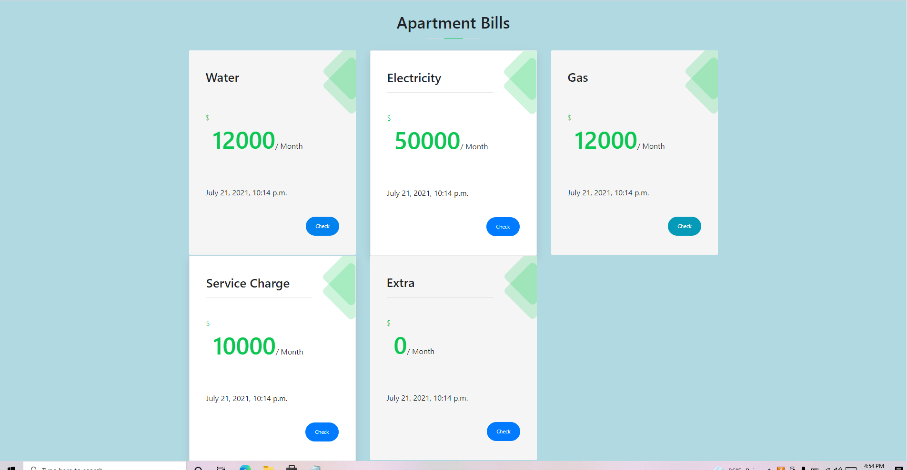
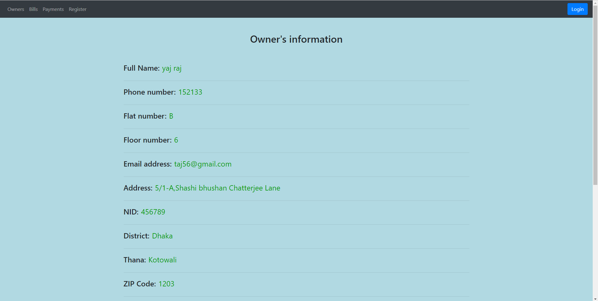
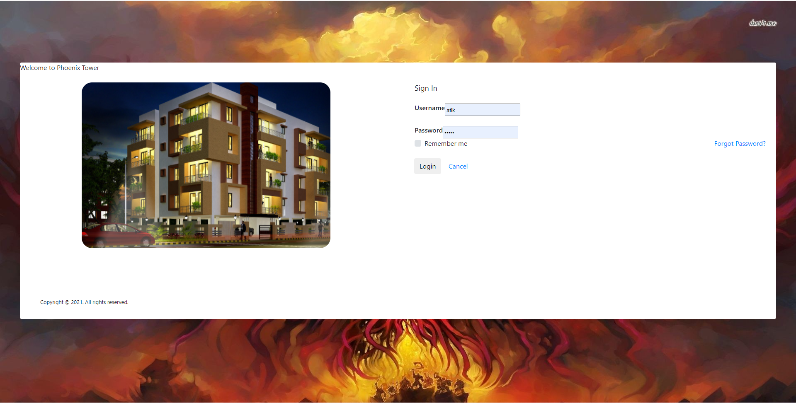
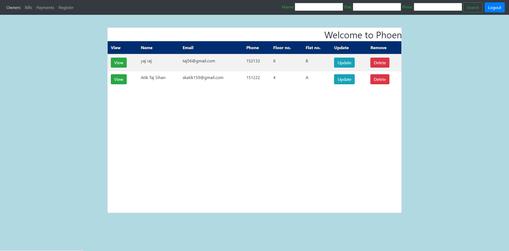
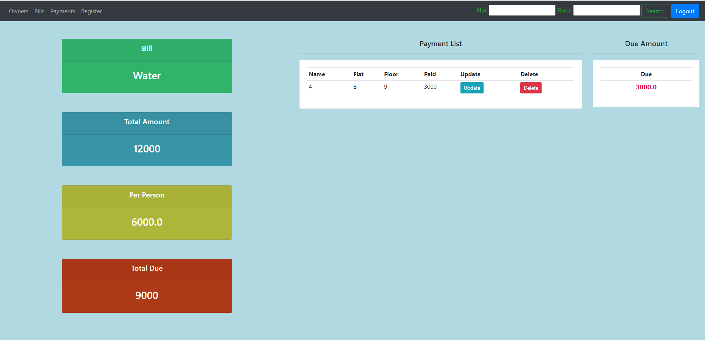
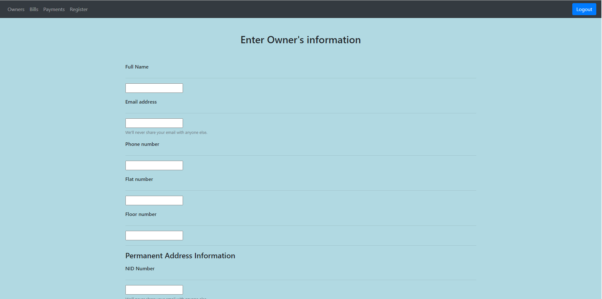
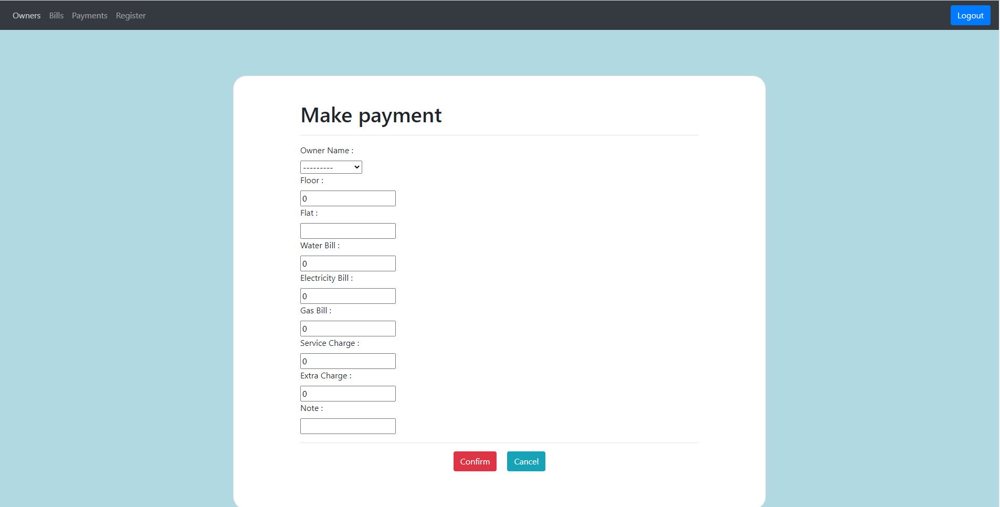
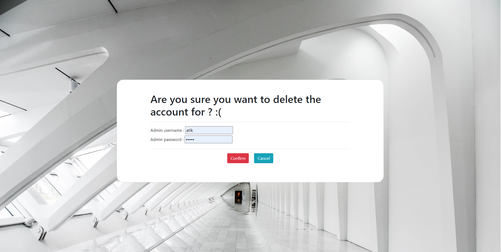

# apartment_management
This project is built with Djnago framework where you can add,update,delete or view users and also can insert bill informations for each month to keep track of the total expenses

Home page

Bills page

Home page

Home page

Home page

Home page

Home page

Home page

Delete page

